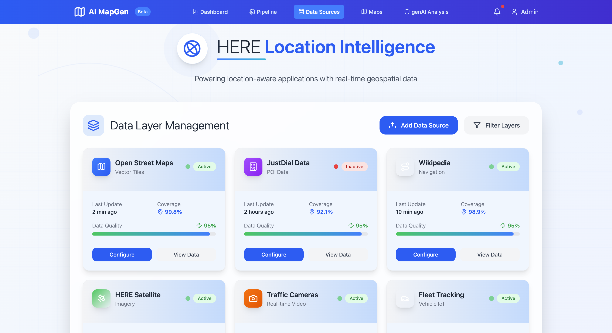

# MapGen


**PPT Link**: [MapGen Presentation](https://www.canva.com/design/DAGoVWDbGM0/vY3ztDvJRSUx-4AMhne5ZQ/edit?utm_content=DAGoVWDbGM0&utm_campaign=designshare&utm_medium=link2&utm_source=sharebutton)

## Overview
This project implements an AI-driven pipeline for updating digital maps using crowd-sourced data. The system leverages modern AI techniques to process, analyze, and integrate various data sources to create and maintain accurate, up-to-date digital maps.

## Features
- **Data Ingestion & Processing**
  - Handles multiple data sources including GPS traces, satellite imagery, and sensor data
  - Automated data cleaning and normalization
  - Integration with OpenStreetMap (Overpass API) for base map data

- **AI-Powered Feature Detection**
  - YOLO-based object detection for map features
  - LLM-based semantic analysis and classification
  - Automated POI (Points of Interest) extraction and validation

- **Map Generation & Visualization**
  - Interactive web interface for map visualization
  - Real-time updates and modifications
  - Custom map styling and feature highlighting

## Project Structure
```
├── client/                 # Frontend React application
├── backend/               # Python-based backend services
│   ├── scrapers/         # Data collection modules
│   ├── utils/            # Utility functions
│   └── sample_data/      # Sample datasets
├── LLM/                  # AI/ML components
│   ├── LLM for geoJSON.ipynb
│   └── Yolo detected to groq.ipynb
└── docker-compose.yml    # Container orchestration
```

## Technology Stack
- **Frontend**: React.js with Mapbox GL
- **Backend**: Python (FastAPI)
- **AI/ML**: 
  - YOLO for object detection
  - LLM (Language Learning Models) for semantic analysis
  - Groq for AI processing
- **Data Processing**: 
  - Overpass API integration
  - GeoJSON handling
  - Custom data scrapers

## Getting Started

### Prerequisites
- Docker and Docker Compose
- Python 3.8+
- Node.js 16+
- API keys for:
  - Mapbox
  - HERE Maps
  - Groq

### Installation
1. Clone the repository:
   ```bash
   git clone [repository-url]
   cd [repository-name]
